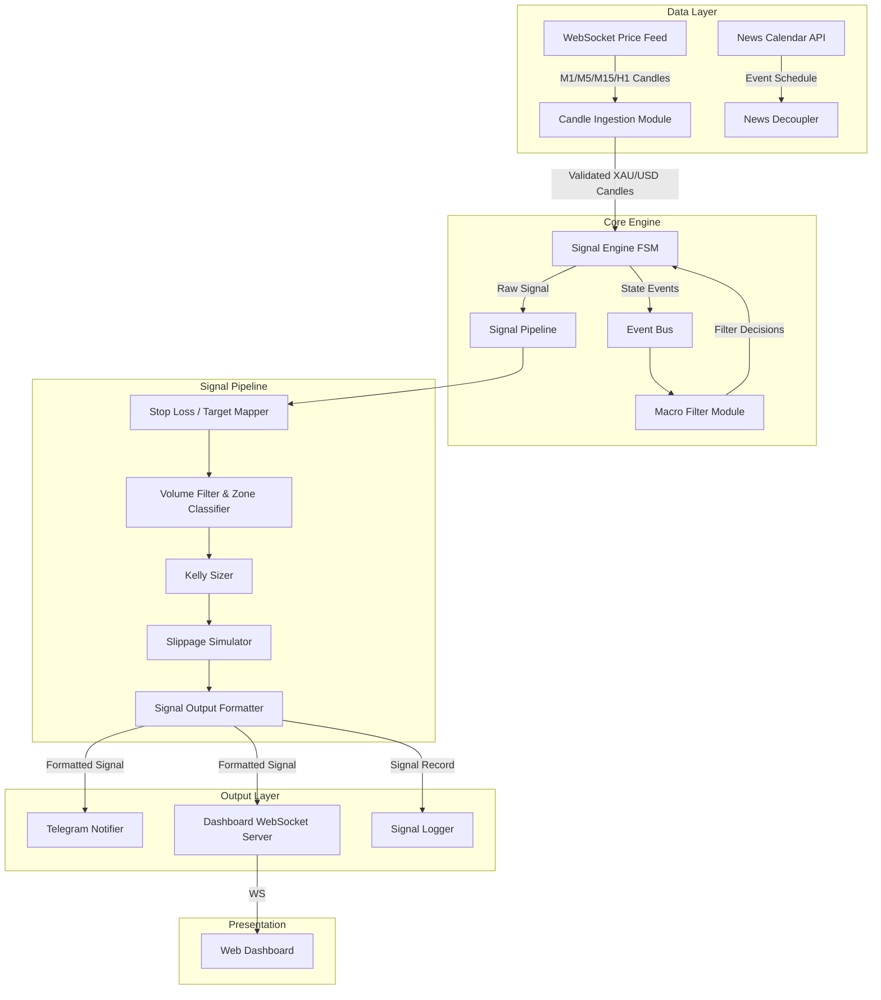
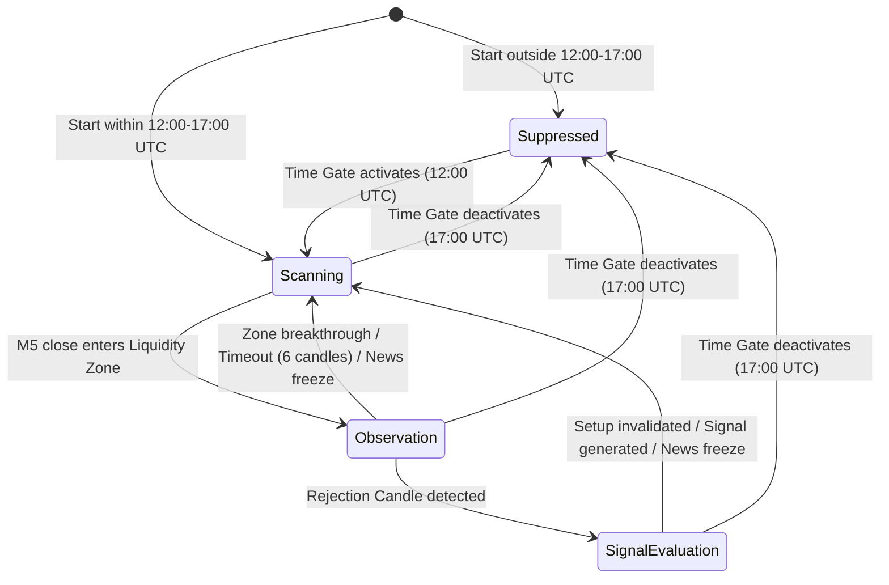
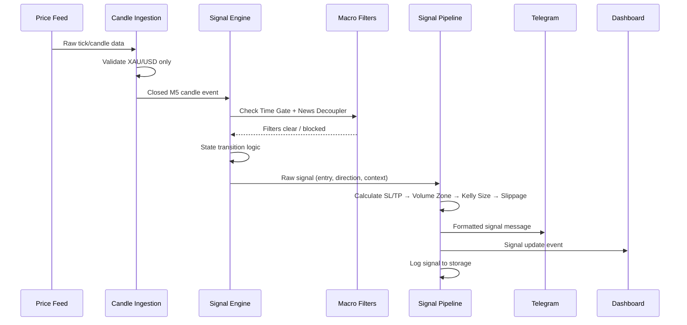
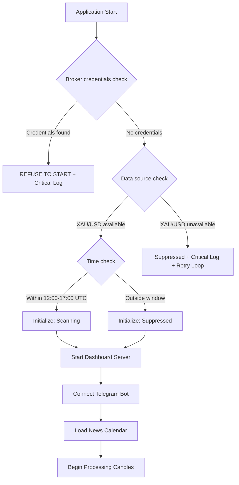

# Technical Design Document: Isagi Engine Signal Bot

## Overview

The Isagi Engine Signal Bot is a real-time, signal-only analysis system for XAU/USD that combines finite state machine (FSM) architecture with multi-timeframe price structure analysis. The system ingests M1, M5, M15, and H1 candlestick data via WebSocket, processes it through a layered filter pipeline, detects structural trade setups using candle pattern recognition, and outputs formatted signals to a web dashboard and Telegram channel.

**Key Design Decisions:**
- **TypeScript/Node.js runtime**: Provides type safety for complex state transitions and async I/O for WebSocket + HTTP operations
- **Finite State Machine core**: The Signal Engine operates as a deterministic FSM with 4 primary states, ensuring predictable behavior and testability
- **Event-driven architecture**: All components communicate via an internal event bus, enabling loose coupling and independent testing
- **Signal-only enforcement**: No broker API dependencies exist in the codebase; the system is architecturally incapable of trade execution
- **SQLite for logging**: Lightweight, file-based durable storage for 90-day log retention without external database infrastructure

## Architecture

### High-Level System Architecture




### Signal Engine State Machine



**State Descriptions:**
- **Suppressed**: Engine is inactive (outside time window or circuit breaker active). No signal generation.
- **Scanning**: Actively monitoring M5 candles for entry into H1/M15 liquidity zones.
- **Observation**: Price is within a liquidity zone; monitoring 3-6 M5 candles for absorption and rejection patterns.
- **SignalEvaluation**: Rejection candle confirmed; evaluating expansion/retracement/entry structure for signal generation.

### Data Flow Sequence




## Components and Interfaces

### 1. Candle Ingestion Module

**Responsibility:** Connects to the market data WebSocket feed, validates that incoming data is XAU/USD only, assembles raw ticks into OHLCV candles for M1/M5/M15/H1 timeframes, and emits closed-candle events.

**Interface:**
```typescript
interface CandleIngestionModule {
  connect(config: DataSourceConfig): Promise<void>;
  disconnect(): Promise<void>;
  onCandleClose(timeframe: Timeframe, handler: (candle: Candle) => void): void;
}

type Timeframe = 'M1' | 'M5' | 'M15' | 'H1';

interface Candle {
  instrument: 'XAUUSD';
  timeframe: Timeframe;
  timestamp: string; // ISO 8601 UTC ms precision
  open: number;
  high: number;
  low: number;
  close: number;
  volume: number;
}

interface DataSourceConfig {
  wsUrl: string;
  instrument: 'XAUUSD';
  timeframes: Timeframe[];
  reconnectIntervalMs: number;
}
```

**Behavior:**
- Rejects any incoming data where instrument !== 'XAUUSD' (Requirement 16)
- Logs rejected instruments with identifier, timestamp, and source
- Auto-reconnects on disconnection with configurable backoff
- Emits candle events only on full candle close (never on incomplete candles)

### 2. Signal Engine FSM

**Responsibility:** Core state machine that processes M5 candle events, manages state transitions, coordinates with macro filters, detects candle structures (observation, expansion, retracement, rejection), and generates raw signals.

**Interface:**
```typescript
interface SignalEngineFSM {
  initialize(currentTime: Date): void;
  processCandle(candle: Candle): void;
  getState(): EngineState;
  onSignal(handler: (signal: RawSignal) => void): void;
  onStateChange(handler: (transition: StateTransition) => void): void;
}

type EngineState = 'suppressed' | 'scanning' | 'observation' | 'signal_evaluation';

interface StateTransition {
  from: EngineState;
  to: EngineState;
  reason: string;
  timestamp: string;
}

interface RawSignal {
  id: string;
  timestamp: string;
  direction: 'long' | 'short';
  entryPrice: number;
  liquidityZoneLevel: number;
  structuralWindowUpper: number;
  structuralWindowLower: number;
  rejectionCandleType: 'shooting_star' | 'hammer' | 'bearish_engulfing' | 'bullish_engulfing';
  expansionCandles: Candle[];
  retracementCandles: Candle[];
  observationCandles: Candle[];
}
```


**State Transition Rules:**

| Current State | Event | Condition | Next State |
|---|---|---|---|
| Suppressed | Clock tick | UTC time reaches 12:00:00 | Scanning |
| Scanning | M5 candle close | Close price enters H1/M15 liquidity zone | Observation |
| Scanning | Clock tick | UTC time reaches 17:00:00 | Suppressed |
| Observation | M5 candle close | Rejection candle pattern detected | SignalEvaluation |
| Observation | M5 candle close | Price breaks zone boundary by ≥1 pip | Scanning |
| Observation | M5 candle close | 6th candle completes without rejection/break | Scanning |
| Observation | News freeze | Freeze window activates | Scanning |
| Observation | Clock tick | UTC time reaches 17:00:00 | Suppressed |
| SignalEvaluation | M5 candle close | Valid signal generated | Scanning |
| SignalEvaluation | M5 candle close | Setup invalidated (retracement > 4 candles, volume, structural window) | Scanning |
| SignalEvaluation | News freeze | Freeze window activates | Scanning |
| SignalEvaluation | Clock tick | UTC time reaches 17:00:00 | Suppressed |

### 3. Liquidity Zone Detector

**Responsibility:** Identifies H1 and M15 structural highs and lows that represent significant order absorption areas (liquidity zones).

**Interface:**
```typescript
interface LiquidityZoneDetector {
  updateZones(candle: Candle): void;
  getActiveZones(): LiquidityZone[];
  isWithinZone(price: number): LiquidityZone | null;
}

interface LiquidityZone {
  id: string;
  timeframe: 'M15' | 'H1';
  type: 'structural_high' | 'structural_low';
  upperBoundary: number;
  lowerBoundary: number;
  identifiedAt: string;
}
```

### 4. Candle Pattern Analyzer

**Responsibility:** Detects specific candlestick patterns (rejection candles, expansion candles) according to the strict definitions in the requirements.

**Interface:**
```typescript
interface CandlePatternAnalyzer {
  isRejectionCandle(candle: Candle, direction: 'bullish' | 'bearish'): RejectionResult;
  isExpansionCandle(candle: Candle, priorStructuralLevel: number, direction: 'bullish' | 'bearish'): boolean;
  getBodyRatio(candle: Candle): number;
  getWickRatio(candle: Candle, side: 'top' | 'bottom'): number;
}

interface RejectionResult {
  isRejection: boolean;
  pattern: 'shooting_star' | 'hammer' | 'bearish_engulfing' | 'bullish_engulfing' | null;
  confidence: number;
}
```

**Pattern Definitions:**
- **Shooting Star**: Top wick ≥ 50% of total range, body in lower third
- **Hammer**: Bottom wick ≥ 2× body length
- **Bearish Engulfing**: Body fully engulfs prior candle's body, bearish close
- **Bullish Engulfing**: Body fully engulfs prior candle's body, bullish close
- **Expansion Candle**: Body ≥ 60% of total high-to-low range


### 5. Macro Filter Module

**Responsibility:** Applies the five gatekeeping filters (Time Gate, News Decoupler, Volume Filter, Circuit Breaker, and the signal-only constraint) to suppress or modify signals.

**Interface:**
```typescript
interface MacroFilterModule {
  isTimeGateActive(currentTime: Date): boolean;
  isNewsFreezeActive(currentTime: Date): boolean;
  isCircuitBreakerActive(currentTime: Date): boolean;
  getFilterStatus(): FilterStatus;
  checkAllFilters(currentTime: Date, candle: Candle): FilterResult;
}

interface FilterStatus {
  timeGate: { active: boolean; windowStart: string; windowEnd: string };
  newsDecoupler: { freezeActive: boolean; currentEvent: string | null; freezeEnd: string | null };
  circuitBreaker: { active: boolean; expiresAt: string | null };
}

interface FilterResult {
  passed: boolean;
  blockedBy: string | null;
  reason: string | null;
}
```

#### 5a. Time Gate

- Active window: 12:00:00 – 16:59:59 UTC (inclusive)
- 17:00:00 UTC is treated as outside the window
- On startup: checks current UTC time and initializes state accordingly
- On deactivation: cancels any in-progress observation/evaluation

#### 5b. News Decoupler

- Data source: Economic calendar API (e.g., Forex Factory feed or similar)
- Monitors: CPI, NFP, FOMC, GDP, PPI high-impact USD releases
- Freeze window: 2 minutes before → 15 minutes after release
- Overlapping events: merged into single continuous freeze window
- Fallback: if data source unavailable, logs warning and continues without freeze

#### 5c. Volume Filter

- Rejects signals where current M5 volume < 20-period SMA of prior closed M5 candles
- Classifies zone based on volume trend of last 5 candles:
  - **Expansion_Zone**: ≥3 of last 5 show sequentially increasing volume → 3.0R target
  - **Chop_Zone**: ≥3 of last 5 show sequentially decreasing volume → 1.5R target
  - **Default**: Neither condition met → 2.0R target (classified as Chop_Zone)

#### 5d. Circuit Breaker

- Monitors M1 candles for 300+ pip adverse movement against most recent signal direction
- On trigger: suppresses new signal generation for 15 minutes
- Generates alert with magnitude, affected signal ID, and timestamp

### 6. Stop Loss and Target Mapper

**Responsibility:** Calculates precise SL and TP levels based on wick clusters and open liquidity pockets.

**Interface:**
```typescript
interface StopLossTargetMapper {
  calculateStopLoss(signal: RawSignal, recentCandles: Candle[], zoneType: 'chop' | 'expansion'): number;
  calculateTargets(signal: RawSignal, stopLoss: number, zoneClassification: ZoneClassification): TargetLevels;
  findWickCluster(candles: Candle[], direction: 'high' | 'low', lookback: number): WickCluster;
  findLiquidityPocket(fromPrice: number, direction: 'up' | 'down', candles: Candle[]): LiquidityPocket;
}

interface WickCluster {
  price: number;
  wickCount: number; // must be >= 3
  range: number; // must be <= 1 pip
}

interface LiquidityPocket {
  startPrice: number;
  endPrice: number;
  width: number; // must be >= 5 pips
}

interface TargetLevels {
  rUnit: number;
  tp1: number; // 35% of distance to tp2
  tp2: number; // Based on zone: 1.5R, 2.0R, or 3.0R
  isValid: boolean; // false if < 1.5R after adjustment
}

type ZoneClassification = 'expansion_zone' | 'chop_zone';
```


### 7. Kelly Sizer

**Responsibility:** Computes dynamic position risk based on the fractional Kelly criterion using rolling drawdown and equity curve variance from the most recent 20 signals.

**Interface:**
```typescript
interface KellySizer {
  calculateRisk(signalHistory: SignalResult[]): KellyResult;
}

interface SignalResult {
  signalId: string;
  pnl: number; // profit/loss in dollars
  riskAmount: number;
  timestamp: string;
}

interface KellyResult {
  riskAmount: number; // $17.50 – $70.00
  riskPercentage: number; // 0.35% – 1.4%
  rollingDrawdown: number; // percentage
  equityCurveVariance: number;
  historicalAverageVariance: number;
  isColdStart: boolean;
  adjustmentReason: string | null;
}
```

**Calculation Logic:**
1. Compute rolling drawdown: peak-to-trough decline in cumulative P&L over last 20 signals
2. Compute equity curve variance: standard deviation of per-signal returns over last 20 signals
3. Apply adjustment rules:
   - Cold start (< 20 signals): default $35.00
   - Drawdown > 5%: linear reduction toward $17.50 floor (reaching floor at 10%)
   - Variance > 1.5× historical average: reduce by 25%
   - Drawdown ≤ 2% AND variance ≤ 1.0× average: allow up to $70.00 ceiling
4. Clamp result between $17.50 floor and $70.00 ceiling

### 8. Slippage Simulator

**Responsibility:** Injects realistic slippage on a random 20% of signals for performance simulation accuracy.

**Interface:**
```typescript
interface SlippageSimulator {
  applySlippage(signal: ProcessedSignal): SlippageResult;
}

interface SlippageResult {
  applied: boolean;
  originalEntry: number;
  adjustedEntry: number;
  slippagePips: number; // 0.5 – 2.5 if applied, 0 if not
}
```

**Logic:**
- Random selection: uniform probability, 20% of signals receive slippage
- Slippage amount: uniform distribution in [0.5, 2.5] pips
- Direction: always negative (adverse to trade direction)
- Applied to entry price only

### 9. Signal Output Formatter

**Responsibility:** Assembles all computed values into the final structured signal output with split position details.

**Interface:**
```typescript
interface SignalOutputFormatter {
  format(input: FormatterInput): FormattedSignal;
}

interface FormatterInput {
  rawSignal: RawSignal;
  stopLoss: number;
  targets: TargetLevels;
  zoneClassification: ZoneClassification;
  kellyResult: KellyResult;
  slippageResult: SlippageResult;
}

interface FormattedSignal {
  id: string;
  timestamp: string;
  instrument: 'XAUUSD';
  direction: 'long' | 'short';
  entryPrice: number;
  stopLoss: number;
  ticket1: TicketDetail; // Safety Lock - 45%
  ticket2: TicketDetail; // Runner - 55%
  zoneClassification: ZoneClassification;
  riskAmount: number;
  rUnit: number;
  reasoning: string; // max 280 chars
  slippage: SlippageResult;
  breakevenTrigger: string;
  trailingStopGuidance: string;
}

interface TicketDetail {
  label: string;
  positionSizePercent: number;
  entryPrice: number;
  stopLoss: number;
  takeProfit: number;
}
```


**Split Position Rules:**
- Ticket 1 (Safety Lock): 45% of position, TP at 35% of distance to Ticket 2 TP
- Ticket 2 (Runner): 55% of position, TP based on zone classification
- Breakeven trigger: When price reaches Ticket 1 TP, Ticket 2 SL moves to entry
- Trailing stop: Most recent M5 structural swing point after breakeven activation

### 10. Telegram Notifier

**Responsibility:** Delivers formatted signal messages to the configured Telegram chat via the Bot API.

**Interface:**
```typescript
interface TelegramNotifier {
  sendSignal(signal: FormattedSignal): Promise<DeliveryResult>;
}

interface TelegramConfig {
  botToken: string;
  chatId: string;
  maxRetries: number; // 3
  baseRetryIntervalMs: number; // 2000
}

interface DeliveryResult {
  success: boolean;
  attempts: number;
  error: string | null;
  timestamp: string;
}
```

**Behavior:**
- Uses Telegram Bot API `sendMessage` endpoint with HTML formatting
- Retry: exponential backoff (2s, 4s, 8s) up to 3 retries
- On all retries failed: logs failure + full signal content for manual review
- Validates all required fields before sending; suppresses if any missing
- **MUST NOT** include trade execution commands or order placement instructions
- Delivery target: within 5 seconds of signal generation

### 11. Dashboard (Web UI)

**Responsibility:** Real-time web interface displaying engine state, signal log, filter status, and Kelly metrics.

**Interface:**
```typescript
interface DashboardServer {
  start(port: number): Promise<void>;
  broadcastSignal(signal: FormattedSignal): void;
  broadcastStateChange(state: EngineState): void;
  broadcastFilterStatus(status: FilterStatus): void;
}

interface DashboardState {
  engineState: EngineState;
  signals: FormattedSignal[]; // last 100, reverse-chronological
  filterStatus: FilterStatus;
  kellyMetrics: KellyResult;
  connectionStatus: 'connected' | 'disconnected';
  lastUpdateTimestamp: string;
}
```

**Technology:**
- Backend: Express.js HTTP server + WebSocket (ws library) for real-time updates
- Frontend: Lightweight HTML/CSS/JS single-page application (no framework)
- Updates pushed via WebSocket within 2 seconds of signal generation
- Displays disconnection indicator with last-update timestamp if connection lost
- Reconnects and resumes live updates within 5 seconds of restoration

### 12. Signal Logger

**Responsibility:** Persists all signals, rejections, state transitions, and filter events to durable storage with 90-day retention.

**Interface:**
```typescript
interface SignalLogger {
  logSignal(signal: FormattedSignal): Promise<void>;
  logRejection(rejection: RejectionLog): Promise<void>;
  logStateTransition(transition: StateTransition): Promise<void>;
  logFilterEvent(event: FilterEvent): Promise<void>;
}

interface RejectionLog {
  timestamp: string; // ISO 8601 UTC ms
  reason: string;
  filter: string;
  context: Record<string, unknown>;
}

interface FilterEvent {
  filterName: string;
  action: 'activated' | 'deactivated';
  timestamp: string; // ISO 8601 UTC ms
  durationSeconds: number | null;
  metadata: Record<string, unknown>;
}
```

**Storage:**
- SQLite database file for durable, file-based persistence
- Survives application restart
- Retention: minimum 90 days (automated cleanup of records older than 90 days)
- Retry on write failure: 3 attempts, then buffer in memory + emit warning
- All timestamps: ISO 8601 UTC with millisecond precision
- Entries stored in chronological order


### 13. Signal-Only Enforcement Layer

**Responsibility:** Architectural guarantee that no trade execution capability exists in the system.

**Design Enforcement:**
- No broker API client libraries included in dependencies
- No configuration schema for broker credentials or trade endpoints
- Startup validation: checks for absence of any broker write-permission credentials
- If any component attempts trade execution invocation → blocked + critical error logged
- Telegram messages are informational only; no execution commands attached
- All outbound HTTP calls are restricted to: market data feeds, Telegram Bot API, and economic calendar API

## Data Models

### Core Domain Models

```typescript
// Candle data stored in rolling buffers per timeframe
interface CandleBuffer {
  timeframe: Timeframe;
  maxSize: number; // M5: 200, M15: 100, H1: 50, M1: 500
  candles: Candle[];
  sma20Volume: number; // rolling 20-period SMA of volume
}

// Signal history for Kelly calculations
interface SignalHistory {
  maxSize: 20;
  signals: SignalResult[];
  cumulativePnl: number;
  peakPnl: number;
}

// Observation state context
interface ObservationContext {
  liquidityZone: LiquidityZone;
  candleCount: number; // 0-6
  candles: Candle[];
  volumeBelowSma: boolean;
  rangeCompressing: boolean;
  startTimestamp: string;
}

// Signal evaluation context
interface EvaluationContext {
  direction: 'long' | 'short';
  expansionCandles: Candle[];
  retracementCandles: Candle[];
  rejectionCandle: Candle | null;
  averageExpansionVolume: number;
  averageExpansionBodySize: number;
  structuralBreakLevel: number;
}
```

### Database Schema (SQLite)

```sql
-- Signals table
CREATE TABLE signals (
  id TEXT PRIMARY KEY,
  timestamp TEXT NOT NULL, -- ISO 8601 UTC ms
  direction TEXT NOT NULL CHECK (direction IN ('long', 'short')),
  entry_price REAL NOT NULL,
  stop_loss REAL NOT NULL,
  tp1 REAL NOT NULL,
  tp2 REAL NOT NULL,
  zone_classification TEXT NOT NULL,
  risk_amount REAL NOT NULL,
  r_unit REAL NOT NULL,
  reasoning TEXT NOT NULL,
  slippage_applied INTEGER NOT NULL DEFAULT 0,
  slippage_pips REAL DEFAULT 0,
  original_entry REAL,
  ticket1_size_pct REAL NOT NULL DEFAULT 45,
  ticket2_size_pct REAL NOT NULL DEFAULT 55,
  created_at TEXT NOT NULL DEFAULT (strftime('%Y-%m-%dT%H:%M:%f', 'now'))
);

-- Rejections table
CREATE TABLE rejections (
  id INTEGER PRIMARY KEY AUTOINCREMENT,
  timestamp TEXT NOT NULL,
  reason TEXT NOT NULL,
  filter_name TEXT NOT NULL,
  context_json TEXT,
  created_at TEXT NOT NULL DEFAULT (strftime('%Y-%m-%dT%H:%M:%f', 'now'))
);

-- State transitions table
CREATE TABLE state_transitions (
  id INTEGER PRIMARY KEY AUTOINCREMENT,
  timestamp TEXT NOT NULL,
  from_state TEXT NOT NULL,
  to_state TEXT NOT NULL,
  reason TEXT NOT NULL,
  created_at TEXT NOT NULL DEFAULT (strftime('%Y-%m-%dT%H:%M:%f', 'now'))
);

-- Filter events table
CREATE TABLE filter_events (
  id INTEGER PRIMARY KEY AUTOINCREMENT,
  filter_name TEXT NOT NULL,
  action TEXT NOT NULL CHECK (action IN ('activated', 'deactivated')),
  timestamp TEXT NOT NULL,
  duration_seconds REAL,
  metadata_json TEXT,
  created_at TEXT NOT NULL DEFAULT (strftime('%Y-%m-%dT%H:%M:%f', 'now'))
);

-- Index for retention cleanup
CREATE INDEX idx_signals_timestamp ON signals(timestamp);
CREATE INDEX idx_rejections_timestamp ON rejections(timestamp);
CREATE INDEX idx_state_transitions_timestamp ON state_transitions(timestamp);
CREATE INDEX idx_filter_events_timestamp ON filter_events(timestamp);
```


### Configuration Model

```typescript
interface SystemConfig {
  // Data source
  dataSource: {
    wsUrl: string;
    instrument: 'XAUUSD';
    reconnectIntervalMs: number;
  };

  // Time gate
  timeGate: {
    startHourUTC: 12;
    startMinuteUTC: 0;
    endHourUTC: 16;
    endMinuteUTC: 59;
    endSecondUTC: 59;
  };

  // Telegram
  telegram: {
    botToken: string;
    chatId: string;
    maxRetries: 3;
    baseRetryMs: 2000;
  };

  // Kelly sizer
  kelly: {
    equityBaseline: 5000;
    floorRisk: 17.50;
    ceilingRisk: 70.00;
    coldStartRisk: 35.00;
    windowSize: 20;
    drawdownThresholdStart: 0.05;
    drawdownThresholdMax: 0.10;
    varianceMultiplierThreshold: 1.5;
    varianceReductionFactor: 0.25;
  };

  // Volume filter
  volume: {
    smaPeriod: 20;
    expansionTrendCount: 3;
    expansionLookback: 5;
  };

  // Circuit breaker
  circuitBreaker: {
    thresholdPips: 300;
    suppressionMinutes: 15;
  };

  // Slippage simulator
  slippage: {
    probabilityPercent: 20;
    minPips: 0.5;
    maxPips: 2.5;
  };

  // Signal structure
  signalStructure: {
    minExpansionCandles: 2;
    minRetracementCandles: 2;
    maxRetracementCandles: 4;
    bodyRatioThreshold: 0.60;
    observationMinCandles: 3;
    observationMaxCandles: 6;
    wickClusterMinCount: 3;
    wickClusterMaxRange: 1.0; // pips
    liquidityPocketMinWidth: 5.0; // pips
    minRewardRisk: 1.5;
  };

  // Dashboard
  dashboard: {
    port: number;
    maxSignalHistory: 100;
  };

  // Logging
  logging: {
    dbPath: string;
    retentionDays: 90;
    maxRetries: 3;
  };
}
```

### Requirements Traceability Matrix

| Component | Requirements Addressed |
|---|---|
| Candle Ingestion Module | R16 (XAU/USD restriction) |
| Signal Engine FSM | R1 (Observation), R2 (Short), R3 (Long), R4 (Entry), R6 (Time Gate) |
| Liquidity Zone Detector | R1 (Zone identification) |
| Candle Pattern Analyzer | R1.5, R2.1-2.3, R3.1-3.3, R4.1 |
| Macro Filter Module | R6 (Time Gate), R7 (News), R9 (Volume), R10.3-10.5 (Circuit Breaker) |
| Stop Loss & Target Mapper | R5 (SL/TP), R9.2-9.4 (Adaptive targets) |
| Kelly Sizer | R8 (Position sizing) |
| Slippage Simulator | R10.1-10.2, R10.6 (Slippage) |
| Signal Output Formatter | R11 (Split position) |
| Telegram Notifier | R12 (Delivery) |
| Dashboard | R13 (Display) |
| Signal Logger | R14 (Logging) |
| Signal-Only Enforcement | R15 (No execution) |


## Correctness Properties

*A property is a characteristic or behavior that should hold true across all valid executions of a system — essentially, a formal statement about what the system should do. Properties serve as the bridge between human-readable specifications and machine-verifiable correctness guarantees.*

### Property 1: Observation Phase Transition Correctness

*For any* M5 candle close price and any set of active H1/M15 liquidity zones, the Signal Engine SHALL transition to Observation Phase if and only if the close price falls within a liquidity zone boundary while in Scanning state. Furthermore, while in Observation Phase, no signals SHALL be generated regardless of candle content until a valid Rejection Candle forms.

**Validates: Requirements 1.1, 1.3**

### Property 2: Observation Phase Termination

*For any* sequence of M5 candles processed during Observation Phase, the phase SHALL terminate by one of exactly three outcomes: (a) a Rejection Candle is detected → transition to Signal Evaluation, (b) a candle closes ≥1 pip beyond the zone far boundary → transition to Scanning, or (c) 6 full candles complete without (a) or (b) → transition to Scanning with timeout reason logged. The observation candle count SHALL always be in [3, 6].

**Validates: Requirements 1.2, 1.4, 1.5, 1.6**

### Property 3: Expansion Candle Detection Invariant

*For any* M5 candle, it is classified as an Expansion Candle if and only if its body (|open - close|) is at least 60% of its total range (high - low), AND it closes beyond the relevant structural level (below prior local minor low for shorts; above highest high of preceding 10 candles for longs).

**Validates: Requirements 2.1, 3.1**

### Property 4: Retracement Validation

*For any* sequence of candles following confirmed expansion, the retracement is valid if and only if: each retracement candle's volume is below the average expansion candle volume, each retracement candle's body/range is smaller than the average expansion candle body/range, and the sequence length is between 2 and 4 candles inclusive.

**Validates: Requirements 2.2, 2.5, 3.2, 3.5**

### Property 5: Setup Invalidation on Retracement Timeout

*For any* signal evaluation where the retracement exceeds 4 M5 candles without a Rejection Candle forming, the Signal Engine SHALL invalidate the setup and return to scanning state, regardless of direction (long or short).

**Validates: Requirements 2.4, 3.4**

### Property 6: Entry Signal Structural Window

*For any* Rejection Candle evaluated for entry signal generation, a signal SHALL be generated if and only if the candle's close price is at or within the structural window bounded by the breakdown/breakout zone and dynamic EMA levels. Close prices exactly on the boundary are treated as within the window.

**Validates: Requirements 4.1, 4.2, 4.4**

### Property 7: Signal Record Completeness

*For any* generated signal, the record SHALL contain all of: timestamp (ISO 8601 UTC), entry price, direction (long/short), originating liquidity zone level, structural window upper and lower boundaries, and rejection candle pattern type — with no null or missing fields.

**Validates: Requirements 4.3, 16.3**

### Property 8: Stop Loss Placement

*For any* generated signal, the stop-loss SHALL be placed 1–2 pips beyond the wick cluster (≥3 wicks within 1-pip vertical range) of the swing high (shorts) or swing low (longs) within a 20-candle lookback from entry. The buffer SHALL be 1 pip for Chop_Zone and 2 pips for Expansion_Zone conditions.

**Validates: Requirements 5.1, 5.2, 5.7**

### Property 9: R-Unit and Minimum Reward-to-Risk

*For any* generated signal with entry price E and stop-loss S, the R_Unit SHALL equal |E - S|, and the final target (after liquidity pocket adjustment) SHALL yield a reward of at least 1.5 × R_Unit. If reward < 1.5R after adjustment, the signal SHALL be invalidated.

**Validates: Requirements 5.3, 5.6**

### Property 10: Target Adjustment for Volume Blocks

*For any* signal with a projected target, if a volume block exceeding 150% of the 20-period average M5 volume exists between entry and target, the target SHALL be adjusted to the nearest open liquidity pocket (≥5 pips width, no blocking volume) before that volume block.

**Validates: Requirements 5.4, 5.5**

### Property 11: Time Gate Enforcement

*For any* UTC timestamp T, the Signal Engine SHALL be in active state (scanning/observation/evaluation) if and only if 12:00:00 ≤ T < 17:00:00 UTC. At any T outside this window, the engine SHALL be in suppressed state with all signals suppressed. On transition to suppressed, any in-progress observation or evaluation SHALL be cancelled.

**Validates: Requirements 6.1, 6.2, 6.4, 6.5**

### Property 12: News Freeze Window Computation

*For any* set of high-impact USD economic events with scheduled times {T₁, T₂, ..., Tₙ}, the freeze window SHALL span from min(Tᵢ) - 2 minutes to max(Tᵢ) + 15 minutes when events overlap (any two events within 17 minutes of each other). During any active freeze window, all signal generation SHALL be suppressed and any in-progress setup SHALL be cancelled.

**Validates: Requirements 7.1, 7.2, 7.3, 7.4, 7.6**

### Property 13: Kelly Sizer Bounded Output

*For any* signal history of length N, the Kelly Sizer output SHALL satisfy: (a) if N < 20: risk = $35.00, (b) if N ≥ 20: $17.50 ≤ risk ≤ $70.00 with linear drawdown reduction toward floor when drawdown ∈ (5%, 10%), 25% variance reduction when variance > 1.5× historical average, and ceiling allowed only when drawdown ≤ 2% AND variance ≤ 1.0× average.

**Validates: Requirements 8.1, 8.4, 8.5, 8.6, 8.7**

### Property 14: Kelly Drawdown Calculation

*For any* sequence of 20 signal P&L results, the rolling drawdown SHALL equal the maximum peak-to-trough decline in the cumulative sum of those P&L values, and the equity curve variance SHALL equal the standard deviation of the per-signal returns.

**Validates: Requirements 8.2, 8.3**

### Property 15: Volume Zone Classification

*For any* set of the last 5 closed M5 candle volumes where the current M5 volume is above the 20-period SMA, the zone SHALL be classified as: Expansion_Zone (target 3.0R) if ≥3 show sequentially increasing volume; Chop_Zone (target 1.5R) if ≥3 show sequentially decreasing volume; default Chop_Zone (target 2.0R) if neither condition is met.

**Validates: Requirements 9.2, 9.3, 9.4**

### Property 16: Volume Filter Rejection

*For any* M5 candle where volume is below the 20-period simple moving average of the prior 20 closed M5 candle volumes, the signal SHALL be rejected.

**Validates: Requirements 9.1**

### Property 17: Slippage Distribution

*For any* sufficiently large set of generated signals, approximately 20% SHALL have slippage applied (uniform random selection), and for each slipped signal, the slippage amount SHALL be uniformly distributed in [0.5, 2.5] pips, applied as negative (adverse) adjustment to entry price only.

**Validates: Requirements 10.1, 10.2**

### Property 18: Circuit Breaker Threshold and Suppression

*For any* 1-minute candle that expands 300 or more pips against the most recent signal's direction, a circuit-breaker alert SHALL be generated. For any time within 15 minutes after a circuit-breaker alert, new signal generation SHALL be suppressed.

**Validates: Requirements 10.3, 10.5**

### Property 19: Split Position Arithmetic

*For any* formatted signal with entry E, stop-loss S, and zone-determined target TP2, the signal SHALL specify: Ticket 1 at 45% position size with TP1 = E + 0.35 × (TP2 - E) for longs (or E - 0.35 × (E - TP2) for shorts), and Ticket 2 at 55% position size with TP at the zone-appropriate R-multiple. Both tickets share the same entry and stop-loss.

**Validates: Requirements 11.1, 11.2, 11.3, 11.4, 11.7**

### Property 20: Telegram Message Content Completeness and Safety

*For any* signal delivered via Telegram, the message SHALL contain: direction, entry price, stop-loss, TP1, TP2, position split details, zone classification, risk amount, and reasoning (≤280 chars). The message SHALL NOT contain any trade execution commands, order placement instructions, or automated action triggers.

**Validates: Requirements 12.2, 12.5, 15.4**

### Property 21: Telegram Delivery Suppression on Invalid Config

*For any* signal where the Telegram chat is not configured or any required field (direction, entry price, stop-loss, TP1, TP2, zone classification, risk amount) is unavailable, the Telegram Notifier SHALL suppress delivery and log an error indicating the missing configuration or field.

**Validates: Requirements 12.6**

### Property 22: Dashboard Signal Ordering and Capacity

*For any* sequence of signals pushed to the dashboard, signals SHALL be displayed in reverse-chronological order (newest first) and the display SHALL retain at minimum the most recent 100 signals, discarding older ones when the limit is exceeded.

**Validates: Requirements 13.2**

### Property 23: Log Entry Completeness and Format

*For any* log entry (signal, rejection, state transition, or filter event), the entry SHALL contain an ISO 8601 UTC timestamp with millisecond precision, and all required fields for its type SHALL be non-null. Log entries SHALL be stored in chronological order.

**Validates: Requirements 14.1, 14.2, 14.3, 14.4, 14.7**

### Property 24: Signal-Only Configuration Enforcement

*For any* system configuration, if broker API credentials with write permissions, trading account credentials, or order submission endpoints are detected, the Signal Engine SHALL refuse to start. The configuration schema SHALL NOT accept or store such fields.

**Validates: Requirements 15.6, 15.7**

### Property 25: XAU/USD Instrument Exclusivity

*For any* incoming price data with instrument identifier I, the system SHALL accept and process the data if and only if I equals 'XAUUSD'. All other instrument data SHALL be discarded with a warning log containing the rejected instrument identifier, receipt timestamp, and data source origin.

**Validates: Requirements 16.1, 16.2**


## Error Handling

### Error Categories and Strategies

| Category | Error Type | Strategy | Recovery |
|---|---|---|---|
| **Data Source** | WebSocket disconnection | Auto-reconnect with exponential backoff (1s, 2s, 4s, 8s, max 60s) | Resume from last known state |
| **Data Source** | Invalid/corrupt candle data | Discard and log warning | Continue processing next candle |
| **Data Source** | XAU/USD unavailable on startup | Log critical, remain suppressed | Retry connection periodically |
| **News API** | Calendar API unavailable | Log warning, continue without freeze | Retry on next poll interval |
| **News API** | Malformed response | Log warning, skip event | Continue with remaining valid events |
| **Telegram** | Message send failure | Retry 3× with exponential backoff (2s, 4s, 8s) | Log failure + full signal content |
| **Telegram** | Bot token invalid | Log critical error | Dashboard still receives signal |
| **Telegram** | Chat ID not configured | Suppress delivery, log error | Signal still logged + displayed on dashboard |
| **Storage** | Log write failure | Retry 3×, then buffer in memory + emit warning | Flush buffer on next successful write |
| **Storage** | Database corruption | Log critical, attempt rebuild from backup | Degrade to in-memory logging |
| **State Machine** | Invalid state transition attempt | Reject transition, log error, remain in current state | Alert on dashboard |
| **Configuration** | Broker credentials detected at startup | Refuse to start, log critical | Require config cleanup |
| **Circuit Breaker** | 300+ pip adverse movement | Generate alert, suppress signals 15 min | Auto-resume after cooldown |

### Error Propagation Rules

1. **Fail-safe**: If in doubt, suppress signal generation rather than emit a potentially invalid signal
2. **Signal integrity**: A signal is only emitted when ALL pipeline stages complete successfully
3. **Partial failures**: If Telegram fails but storage succeeds, the signal is still considered delivered (dashboard + log are primary)
4. **State preservation**: Engine state is never corrupted by I/O failures; state transitions are computed from candle data, not external system status
5. **Graceful degradation**: Individual output channel failures (Telegram, Dashboard) do not affect core engine operation or other channels

### Startup Validation Sequence




## Testing Strategy

### Dual Testing Approach

The system uses both property-based tests and example-based unit tests for comprehensive coverage.

**Property-Based Testing Framework:** [fast-check](https://github.com/dubzzz/fast-check) for TypeScript

Property-based tests verify universal correctness properties across randomized inputs. Each property test runs a minimum of 100 iterations with generated inputs.

**Unit tests** focus on:
- Specific candle pattern examples (concrete shooting star, hammer, engulfing)
- Integration points between FSM states and pipeline stages
- Edge cases (exact boundary values, empty histories, cold start)
- Error handling paths (Telegram failures, storage failures)

### Property-Based Test Plan

Each property test references its corresponding design property and runs ≥100 iterations:

| Test | Property | Generator Strategy |
|---|---|---|
| FSM Observation Entry | Property 1 | Random candle closes × random zone boundaries |
| FSM Observation Termination | Property 2 | Random 3-6 candle sequences with/without rejection/breakthrough |
| Expansion Detection | Property 3 | Random OHLCV candles with varying body ratios |
| Retracement Validation | Property 4 | Random expansion + retracement candle pairs with varying volumes |
| Retracement Timeout | Property 5 | Random 5+ candle sequences without rejection |
| Structural Window Decision | Property 6 | Random close prices × random window boundaries |
| Signal Completeness | Property 7 | Random valid signal contexts |
| SL Placement | Property 8 | Random 20-candle histories with wick clusters |
| R-Unit and Min Reward | Property 9 | Random entry/SL/target combinations |
| Target Adjustment | Property 10 | Random candle histories with volume blocks |
| Time Gate | Property 11 | Random UTC timestamps across 24-hour range |
| News Freeze Windows | Property 12 | Random event time sets with overlaps |
| Kelly Bounded Output | Property 13 | Random P&L histories of varying lengths |
| Kelly Drawdown Calculation | Property 14 | Random 20-element P&L sequences |
| Volume Classification | Property 15 | Random 5-candle volume sequences |
| Volume Rejection | Property 16 | Random candles × random SMA values |
| Slippage Distribution | Property 17 | Large batches (1000+) of signals |
| Circuit Breaker | Property 18 | Random M1 candle movements × signal directions |
| Split Position Math | Property 19 | Random entry/SL/TP combinations × zone types |
| Telegram Content | Property 20 | Random formatted signals |
| Telegram Suppression | Property 21 | Random signals with missing fields |
| Dashboard Ordering | Property 22 | Random timestamp sequences |
| Log Completeness | Property 23 | Random log event types |
| Config Enforcement | Property 24 | Random config objects with/without broker fields |
| Instrument Filter | Property 25 | Random instrument identifiers |

**Tag Format:** Each test is tagged with:
```
// Feature: isagi-engine-signal-bot, Property {N}: {property title}
```

### Unit Test Plan

| Area | Test Cases |
|---|---|
| Candle Patterns | Concrete shooting star, hammer, bearish engulfing, bullish engulfing examples |
| FSM Integration | Full scenario: scanning → observation → evaluation → signal generation |
| News Decoupler | Unavailable calendar source fallback behavior |
| Telegram Retry | 3× failure with correct backoff timing |
| Storage Retry | Write failure → memory buffer → flush on recovery |
| Startup Validation | Broker credentials present → refuse to start |
| Dashboard Connection | Disconnect indicator shown → reconnect → indicator removed |
| Cold Start Kelly | First 19 signals all get $35.00 risk |

### Integration Test Plan

| Scenario | Verification |
|---|---|
| End-to-end signal flow | WebSocket candle → FSM → Pipeline → Telegram + Dashboard + Log |
| Telegram delivery timing | Signal generated → message received within 5 seconds |
| Dashboard WebSocket update | Signal generated → dashboard state updated within 2 seconds |
| Log persistence | Write signals → restart app → verify signals readable from storage |
| 90-day retention | Write old entries → run cleanup → verify entries > 90 days removed |
| Multi-filter interaction | Time Gate + News Decoupler + Circuit Breaker all active simultaneously |
