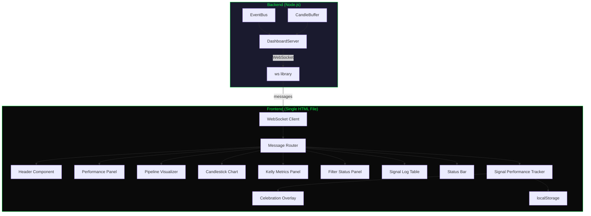
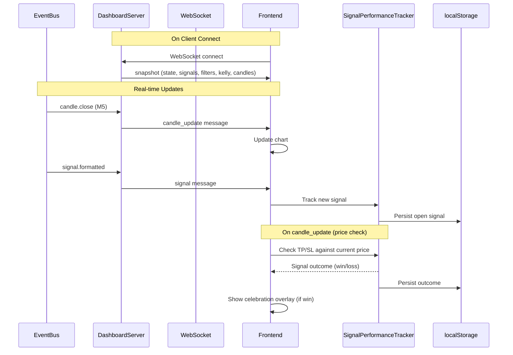

# Technical Design Document: Quant Dashboard Redesign

## Overview

This design transforms the existing Isagi Engine Signal Bot dashboard from a basic monitoring interface into a professional-grade quant trading terminal. The redesign introduces a dark theme with neon green/yellow accents, a live interactive XAU/USD candlestick chart, FSM pipeline visualization, signal performance tracking with simulated P&L, and a celebration overlay for Take Profit hits.

The system is **signal-only** — it does not execute trades. All P&L metrics are simulated based on whether the live market price reaches the signal's Take Profit or Stop Loss level.

### Key Design Decisions

| Decision | Choice | Rationale |
|----------|--------|-----------|
| Charting library | TradingView lightweight-charts (CDN) | Vanilla JS compatible, no build step, lightweight (~40KB), purpose-built for financial charts |
| Frontend framework | None (vanilla HTML/CSS/JS) | Maintains existing architecture, no build tooling required |
| Layout system | CSS Grid + CSS Custom Properties | Native browser support, easy theming, responsive without a framework |
| Celebration animation | CSS animations + Canvas API particles | No external animation library needed, performant, hardware-accelerated |
| Persistence | localStorage | Client-side only, survives page refreshes, no backend DB changes needed |
| Chart interactivity | Built-in lightweight-charts zoom/scroll | Library provides pinch-zoom, mouse wheel zoom, drag-to-scroll out of the box |

## Architecture

### System Architecture Diagram



### Data Flow



### Backend Modifications

The existing `DashboardServer` needs minimal changes:

1. **Add `candle_update` message type** to the `WsMessageType` union
2. **Add candle buffer** to the snapshot payload (last 100 M5 candles)
3. **Add `broadcastCandleUpdate()` method** — called when EventBus emits `candle.close` for M5 timeframe
4. **Add candle history storage** — maintain a ring buffer of the last 100 closed M5 candles

No changes to the existing EventBus are required — the `candle.close` event already exists.

## Components and Interfaces

### Backend Components

#### Extended DashboardServer Interface

```typescript
// New message types added to existing WsMessageType
export type WsMessageType =
  | 'snapshot'
  | 'signal'
  | 'state_change'
  | 'filter_status'
  | 'kelly_metrics'
  | 'candle_update';  // NEW

// Extended snapshot payload
export interface DashboardSnapshot {
  engineState: EngineState;
  signals: FormattedSignal[];
  filterStatus: FilterStatus;
  kellyMetrics: KellyResult | null;
  candles: Candle[];           // NEW: last 100 M5 candles
  lastUpdateTimestamp: string;
}

// Candle update message payload
export interface CandleUpdatePayload {
  candle: Candle;            // The closed M5 candle
  hasGap: boolean;           // True if there was a data feed interruption
}

// Extended DashboardServer interface
export interface DashboardServer {
  // ... existing methods ...
  broadcastCandleUpdate(candle: Candle, hasGap?: boolean): void;  // NEW
}
```

#### EventBus Integration

```typescript
// In main.ts or wherever DashboardServer is wired up:
eventBus.subscribe('candle.close', (event: CandleCloseEvent) => {
  if (event.timeframe === 'M5') {
    dashboardServer.broadcastCandleUpdate(event.candle);
  }
});
```

### Frontend Components

All frontend components are vanilla JavaScript modules (IIFEs or namespaced objects) within the single `index.html` file.

#### Component Hierarchy

```
DashboardApp (root)
├── HeaderBar
│   ├── BotIdentity ("ISAGI • QUANT")
│   ├── InstrumentBadge ("XAU/USD")
│   ├── ModeIndicator ("SIGNAL ONLY")
│   ├── UTCClock (HH:MM:SS, updates every 1s)
│   └── ConnectionIndicator (green/red dot)
├── PerformancePanel
│   ├── TotalSignals (count)
│   ├── WinRate (percentage)
│   ├── SimulatedPnL (dollars, yellow)
│   └── AvgRiskReward (ratio)
├── MainContent
│   ├── CandlestickChart (lightweight-charts)
│   │   ├── CandleSeries (M5 OHLCV)
│   │   ├── SignalMarkers (entry arrows)
│   │   └── PriceLines (SL red dashed, TP green dashed)
│   └── PipelineVisualizer
│       ├── StageNode (Suppressed)
│       ├── StageNode (Scanning)
│       ├── StageNode (Observation)
│       └── StageNode (Signal Evaluation)
├── SidePanel
│   ├── KellyMetricsPanel
│   │   ├── RiskAmount
│   │   ├── RollingDrawdown
│   │   ├── EquityCurveVariance
│   │   └── ColdStartIndicator
│   └── FilterStatusPanel
│       ├── TimeGateFilter
│       ├── NewsDecouplerFilter
│       └── CircuitBreakerFilter
├── SignalLogTable
│   ├── TableHeader
│   └── TableRows (max 100, reverse-chronological)
├── StatusBar (fixed bottom)
│   ├── SimulatedPnL
│   ├── SignalCount
│   ├── KellyRisk
│   └── ConnectionLatency
└── CelebrationOverlay (hidden, shown on TP hit)
    ├── ProfitDisplay
    ├── SignalDetails
    ├── ParticleCanvas
    ├── CloseButton
    └── AutoDismissTimer (5s)
```

#### Signal Performance Tracker (Client-Side Module)

```typescript
// Conceptual interface for the client-side tracker
interface SignalOutcome {
  signalId: string;
  direction: 'long' | 'short';
  entryPrice: number;
  stopLoss: number;
  takeProfit1: number;
  takeProfit2: number;
  outcome: 'pending' | 'win' | 'loss';
  pnl: number;          // Simulated dollar P&L
  resolvedAt: string | null;
}

interface PerformanceMetrics {
  totalSignals: number;
  wins: number;
  losses: number;
  pending: number;
  winRate: number;        // wins / (wins + losses) as percentage
  cumulativePnL: number;  // Sum of all resolved signal P&Ls
  avgRiskReward: number;  // Average |TP distance| / |SL distance|
}

// localStorage keys
const STORAGE_KEY_OUTCOMES = 'isagi_signal_outcomes';
const STORAGE_KEY_METRICS = 'isagi_performance_metrics';
```

**P&L Calculation Logic:**
- For a LONG signal: `pnl = takeProfit - entryPrice` (win) or `pnl = -(entryPrice - stopLoss)` (loss)
- For a SHORT signal: `pnl = entryPrice - takeProfit` (win) or `pnl = -(stopLoss - entryPrice)` (loss)
- The tracker monitors each candle_update's close price against open signals' TP1/SL levels
- TP1 is used as the primary profit target for outcome tracking

#### Celebration Overlay

```typescript
// Celebration trigger conditions
interface CelebrationData {
  signalId: string;
  direction: 'long' | 'short';
  entryPrice: number;
  takeProfitPrice: number;
  profitAmount: number;
}

// Animation: CSS keyframes for fade-in/fade-out + Canvas 2D particle system
// Duration: 5 seconds auto-dismiss
// Particles: Gold/yellow colored circles with random velocity and gravity
```

#### Candlestick Chart Integration

```typescript
// Using lightweight-charts from CDN
// <script src="https://unpkg.com/lightweight-charts/dist/lightweight-charts.standalone.production.js"></script>

// Chart initialization
const chart = LightweightCharts.createChart(container, {
  width: container.clientWidth,
  height: 400,
  layout: {
    background: { type: 'solid', color: '#0a0a0a' },
    textColor: '#00ff41',
  },
  grid: {
    vertLines: { color: '#1a3a1a' },
    horzLines: { color: '#1a3a1a' },
  },
  crosshair: { mode: LightweightCharts.CrosshairMode.Normal },
  timeScale: {
    timeVisible: true,
    secondsVisible: false,
    borderColor: '#1a3a1a',
  },
});

const candleSeries = chart.addCandlestickSeries({
  upColor: '#00ff41',
  downColor: '#ff4444',
  borderUpColor: '#00ff41',
  borderDownColor: '#ff4444',
  wickUpColor: '#00ff41',
  wickDownColor: '#ff4444',
});

// Signal markers using series markers API
// Price lines for SL/TP using createPriceLine()
```

## Data Models

### WebSocket Message Protocol

| Message Type | Direction | Payload | Trigger |
|---|---|---|---|
| `snapshot` | Server → Client | Full state + candle history | On connect |
| `signal` | Server → Client | `FormattedSignal` | New signal generated |
| `state_change` | Server → Client | `{ engineState: EngineState }` | FSM transition |
| `filter_status` | Server → Client | `FilterStatus` | Filter state change |
| `kelly_metrics` | Server → Client | `KellyResult` | Kelly recalculation |
| `candle_update` | Server → Client | `CandleUpdatePayload` | M5 candle close |

### localStorage Schema

```json
{
  "isagi_signal_outcomes": [
    {
      "signalId": "sig_abc123",
      "direction": "long",
      "entryPrice": 2345.50,
      "stopLoss": 2340.00,
      "takeProfit1": 2355.00,
      "takeProfit2": 2365.00,
      "outcome": "win",
      "pnl": 9.50,
      "resolvedAt": "2024-01-15T14:30:00.000Z"
    }
  ],
  "isagi_performance_metrics": {
    "totalSignals": 47,
    "wins": 28,
    "losses": 14,
    "pending": 5,
    "winRate": 66.67,
    "cumulativePnL": 142.50,
    "avgRiskReward": 1.73
  }
}
```

### CSS Theme Variables

```css
:root {
  /* Primary colors */
  --bg-primary: #0a0a0a;
  --bg-panel: #111111;
  --bg-panel-header: #0d0d0d;
  --border-dim: #1a3a1a;
  --border-panel: #1c1c1c;

  /* Accent colors */
  --neon-green: #00ff41;
  --neon-green-dim: #00cc33;
  --gold-yellow: #ffd700;
  --profit-green: #00ff41;
  --loss-red: #ff4444;
  --muted-gray: #444444;
  --text-dim: #666666;

  /* Typography */
  --font-mono: 'JetBrains Mono', 'Fira Code', 'SF Mono', monospace;
  --font-sans: -apple-system, BlinkMacSystemFont, 'Segoe UI', sans-serif;

  /* Spacing */
  --gap-sm: 8px;
  --gap-md: 16px;
  --gap-lg: 24px;

  /* Transitions */
  --transition-fast: 150ms ease;
  --transition-normal: 300ms ease;
}
```

### Grid Layout Structure

```css
.dashboard-grid {
  display: grid;
  grid-template-areas:
    "header header header"
    "perf   perf   perf"
    "chart  chart  side"
    "pipe   pipe   side"
    "log    log    log"
    "status status status";
  grid-template-columns: 1fr 1fr 300px;
  grid-template-rows: auto auto 400px auto 1fr auto;
  gap: var(--gap-md);
  height: 100vh;
}
```

## Correctness Properties

*A property is a characteristic or behavior that should hold true across all valid executions of a system — essentially, a formal statement about what the system should do. Properties serve as the bridge between human-readable specifications and machine-verifiable correctness guarantees.*

### Property 1: Simulated P&L calculation correctness

*For any* signal with direction D (long or short), entry price E, take profit TP, and stop loss SL where TP ≠ E and SL ≠ E: if the outcome is a win, the P&L SHALL equal |TP - E| (positive); if the outcome is a loss, the P&L SHALL equal -|SL - E| (negative). Specifically: LONG win = (TP - E), LONG loss = -(E - SL), SHORT win = (E - TP), SHORT loss = -(SL - E).

**Validates: Requirements 3.1, 3.2, 3.3**

### Property 2: Performance metrics aggregation consistency

*For any* set of resolved signal outcomes, the win rate SHALL equal (number of wins / total resolved signals) × 100, and cumulative P&L SHALL equal the sum of all individual signal P&Ls, and average risk-to-reward SHALL equal the mean of |TP - entry| / |entry - SL| across all signals.

**Validates: Requirements 3.4, 3.5**

### Property 3: Signal outcome persistence round-trip

*For any* set of signal outcomes stored to localStorage, reading back from localStorage and parsing SHALL produce an identical set of outcomes with the same signal IDs, directions, prices, outcomes, and P&L values.

**Validates: Requirements 3.6**

### Property 4: WebSocket reconnection backoff bounds

*For any* sequence of N consecutive reconnection failures (where N ≥ 0), the reconnection delay SHALL be min(1000 × 2^N, 30000) milliseconds — always bounded between 1 second (minimum) and 30 seconds (maximum).

**Validates: Requirements 9.1**

### Property 5: Signal log ordering invariant

*For any* set of signals added to the signal log, the displayed signals SHALL be ordered in strictly reverse-chronological order (most recent timestamp first), and the total displayed count SHALL never exceed 100 regardless of how many signals have been received.

**Validates: Requirements 11.1, 11.4**

### Property 6: Candle buffer size and validity invariant

*For any* sequence of candle_update messages received by the server, the candle buffer SHALL contain at most 100 candles, and every candle in the buffer SHALL satisfy: high ≥ max(open, close) AND low ≤ min(open, close) AND all OHLCV fields are positive numbers.

**Validates: Requirements 12.2, 12.3**

## Error Handling

### WebSocket Connection Failures

| Scenario | Handling |
|----------|----------|
| Initial connection failure | Show disconnection banner immediately, begin exponential backoff |
| Connection drop during use | Display banner with last update timestamp, begin reconnection |
| Malformed message received | Silently ignore, log to console in development |
| Snapshot missing fields | Use defaults (empty arrays, null metrics) for missing data |

### Candle Data Gaps

| Scenario | Handling |
|----------|----------|
| Gap in candle feed | Server includes `hasGap: true` in next candle_update |
| Chart receives gap indicator | Display visual break (gap in candle series) |
| Initial load with < 100 candles | Render whatever is available, chart handles sparse data |

### Signal Performance Tracker Errors

| Scenario | Handling |
|----------|----------|
| localStorage full | Log warning, continue tracking in-memory only |
| Corrupted localStorage data | Reset to empty state, log warning |
| Signal with invalid prices | Skip tracking for that signal, log error |
| Multiple TP/SL hit in same candle | Use the first level reached (TP takes priority if both hit) |

### Celebration Overlay Edge Cases

| Scenario | Handling |
|----------|----------|
| Multiple TPs hit simultaneously | Queue celebrations, show one at a time |
| Page visibility hidden during TP | Skip celebration, still record outcome |
| Overlay active when new TP hits | Queue next celebration after current dismisses |

## Testing Strategy

### Unit Tests

Unit tests verify specific behaviors with concrete examples:

1. **Signal Performance Tracker**
   - P&L calculation for specific LONG/SHORT win/loss scenarios
   - Win rate edge cases (0 signals, all wins, all losses)
   - localStorage serialization/deserialization
   - Metric recalculation on new outcome

2. **WebSocket Message Handling**
   - Snapshot parsing with all fields present
   - Snapshot parsing with missing optional fields
   - Candle update processing
   - State change handling

3. **Celebration Overlay Logic**
   - Trigger conditions (TP hit detection)
   - Auto-dismiss timer (5 seconds)
   - Queue behavior for multiple celebrations
   - Manual dismiss via close button

4. **Candle Buffer Management**
   - Append new candle to buffer
   - Buffer size cap at 100
   - Gap indicator handling

### Property-Based Tests

Property-based testing is appropriate for the pure calculation logic in this feature, specifically:
- **Signal P&L calculations** — pure functions with clear numeric input/output
- **Performance metric aggregation** — mathematical properties that must hold for all input sets
- **Reconnection delay calculation** — bounded arithmetic with clear invariants
- **Signal ordering/buffer invariants** — structural properties

**Library:** [fast-check](https://github.com/dubzzz/fast-check) (already compatible with vitest)

**Configuration:**
- Minimum 100 iterations per property test
- Each test tagged with: `Feature: quant-dashboard-redesign, Property {N}: {description}`

Property tests to implement:
1. **Property 1**: Generate random direction/entry/TP/SL prices, verify P&L formula correctness for both long and short
2. **Property 2**: Generate random outcome arrays, verify win rate, cumulative P&L, and avg R:R calculations
3. **Property 3**: Generate random outcome objects, serialize to JSON, deserialize, verify deep equality
4. **Property 4**: Generate random failure counts (0-20), verify delay is within [1000, 30000] bounds
5. **Property 5**: Generate random signal arrays with timestamps, verify sorting invariant and max-100 cap
6. **Property 6**: Generate random candle sequences, verify buffer size ≤ 100 and OHLC validity

### Integration Tests

Integration tests verify the WebSocket communication and end-to-end behavior:

1. **WebSocket server sends snapshot on connect** — connect a client, verify snapshot structure
2. **WebSocket server broadcasts candle_update** — emit candle.close event, verify client receives message
3. **Reconnection behavior** — disconnect server, verify client attempts reconnection
4. **Full signal lifecycle** — send signal, send candle updates that hit TP, verify outcome recorded
