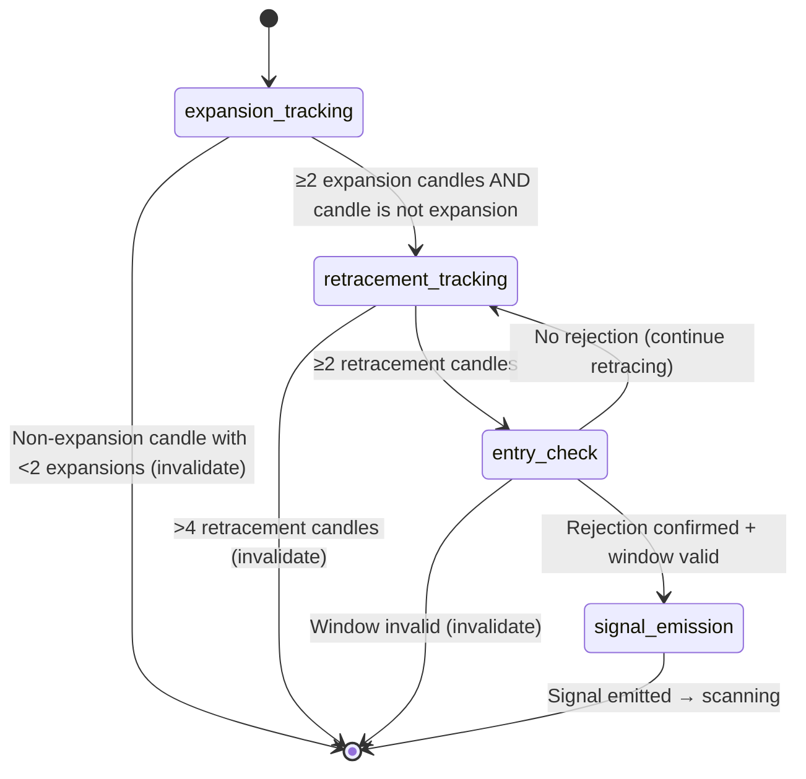

# Technical Design: Signal Evaluation Logic

## Overview

This design specifies the implementation of `handleSignalEvaluationState()` in the `SignalEngineFSM` class. This method is invoked when the FSM enters the `signal_evaluation` state (after a rejection candle is detected in the observation phase). It orchestrates a three-sub-phase pipeline — **expansion tracking → retracement tracking → entry check** — and either emits a `RawSignal` on success or transitions back to `scanning` on invalidation.

The design integrates with:
- The existing `CandlePatternAnalyzer` for rejection/expansion candle detection
- The existing `EntrySignalGenerator` for structural window validation and signal construction
- The `EvaluationContext` type for internal state tracking
- The `emitSignal()` method for downstream signal publishing

### Design Goals

1. **Correctness**: Every emitted signal satisfies all structural requirements (expansion count, retracement count, rejection confirmation, window validation).
2. **Fail-fast invalidation**: Invalid setups are detected early and the FSM returns to `scanning` without delay.
3. **Signal-only**: No trade execution references or capabilities — signals are published to the event bus only.
4. **Testability**: Pure algorithmic logic separated from I/O, enabling comprehensive property-based testing.

## Architecture

The signal evaluation logic runs as a sub-state machine within the `signal_evaluation` state of the parent FSM. Each incoming M5 candle is processed through the current sub-phase.



### Sub-Phase Lifecycle

| Sub-phase | Entry Condition | Exit: Success | Exit: Failure |
|-----------|----------------|---------------|---------------|
| `expansion_tracking` | FSM enters `signal_evaluation` | First non-expansion candle after ≥2 expansions | Non-expansion candle with <2 expansions |
| `retracement_tracking` | Expansion phase complete | ≥2 retracement candles accumulated | >4 retracement candles without rejection |
| `entry_check` | ≥2 retracement candles | Rejection candle + window valid | Window validation fails |

### Integration with Parent FSM

The parent FSM's `handleSignalEvaluationState()` method delegates to the sub-phase logic. The sub-phase is tracked via a new field `evaluationSubPhase` on the evaluation context (or a local enum within the method). The parent FSM handles external interrupts (Time Gate deactivation, News Freeze) which override sub-phase processing.

## Components and Interfaces

### Modified: `SignalEngineFSM` class

The `handleSignalEvaluationState(candle: Candle, currentTime: Date)` method will be fully implemented to replace the current placeholder.

#### New Private Fields

```typescript
/** Sub-phase within signal_evaluation */
private evaluationSubPhase: 'expansion_tracking' | 'retracement_tracking' | 'entry_check' = 'expansion_tracking';
```

#### New Private Methods

```typescript
/**
 * Classify a candle as an expansion candle based on body ratio and direction.
 * Returns true if body ratio ≥ 0.6 AND close moves away from zone.
 */
private isExpansionCandle(candle: Candle, direction: 'long' | 'short'): boolean;

/**
 * Classify a candle as a retracement candle based on direction.
 * For short: close > open (bullish = pulling back toward zone)
 * For long: close < open (bearish = pulling back toward zone)
 */
private isRetracementCandle(candle: Candle, direction: 'long' | 'short'): boolean;

/**
 * Update EvaluationContext averages when a new expansion candle is added.
 */
private updateExpansionAverages(ctx: EvaluationContext): void;

/**
 * Construct and emit a RawSignal from the current evaluation and observation contexts.
 */
private constructAndEmitSignal(ctx: EvaluationContext, currentTime: Date): void;

/**
 * Invalidate the current setup: clear contexts and transition to scanning.
 */
private invalidateSetup(reason: string, currentTime: Date): void;
```

### Modified: `EvaluationContext` (types/state.ts)

A new optional field tracks the sub-phase:

```typescript
export interface EvaluationContext {
  direction: 'long' | 'short';
  expansionCandles: Candle[];
  retracementCandles: Candle[];
  rejectionCandle: Candle | null;
  averageExpansionVolume: number;
  averageExpansionBodySize: number;
  structuralBreakLevel: number;
  /** Sub-phase within signal evaluation */
  subPhase: 'expansion_tracking' | 'retracement_tracking' | 'entry_check';
}
```

### Dependency: `CandlePatternAnalyzer`

Already injected via `SignalEngineFSMDependencies`. Used for:
- `isRejectionCandle(candle, direction, priorCandle)` → entry rejection detection
- `getBodyRatio(candle)` → expansion candle qualification

### Dependency: `ObservationContext`

The observation context (from the prior state) provides:
- `liquidityZone` → zone boundaries for structural window validation
- `candles` → observation candle array for signal construction

### Signal Construction (via `emitSignal`)

The existing `emitSignal(signal: RawSignal)` method is called directly. No new external dependencies are introduced.

## Data Models

### Sub-Phase Tracking

```typescript
type EvaluationSubPhase = 'expansion_tracking' | 'retracement_tracking' | 'entry_check';
```

### Expansion Candle Classification

| Field | Rule |
|-------|------|
| Body Ratio | `abs(open - close) / (high - low) >= 0.6` |
| Direction (short) | `close < open` (bearish) |
| Direction (long) | `close > open` (bullish) |

### Retracement Candle Classification

| Field | Rule |
|-------|------|
| Direction (short) | `close > open` (bullish = pulling back) |
| Direction (long) | `close < open` (bearish = pulling back) |

### Signal Construction Data Flow

```typescript
RawSignal {
  id: randomUUID(),
  timestamp: currentTime.toISOString(),
  direction: ctx.direction,
  entryPrice: rejectionCandle.close,
  liquidityZoneLevel: (zone.upperBoundary + zone.lowerBoundary) / 2,
  structuralWindowUpper: zone.upperBoundary,
  structuralWindowLower: zone.lowerBoundary,
  rejectionCandleType: rejectionResult.pattern,
  expansionCandles: ctx.expansionCandles,
  retracementCandles: ctx.retracementCandles,
  observationCandles: observationContext.candles,
}
```

### Configuration Constants

| Constant | Value | Source |
|----------|-------|--------|
| `MIN_EXPANSION_CANDLES` | 2 | Requirements 1.5 |
| `MIN_RETRACEMENT_CANDLES` | 2 | Requirements 2.5 |
| `MAX_RETRACEMENT_CANDLES` | 4 | Requirements 2.6 |
| `BODY_RATIO_THRESHOLD` | 0.6 | Requirements 1.1 |

### Algorithm: `handleSignalEvaluationState`

```
INPUT: candle (M5), currentTime
CONTEXT: evaluationContext (direction, expansionCandles, retracementCandles, subPhase, ...)
         observationContext (liquidityZone, candles)

1. Guard: if evaluationContext is null → invalidate("evaluation_context_missing")

2. SWITCH on evaluationContext.subPhase:

   CASE expansion_tracking:
     a. IF isExpansionCandle(candle, direction):
        - Append to expansionCandles
        - Update averageExpansionVolume, averageExpansionBodySize
     b. ELSE:
        - IF expansionCandles.length >= 2:
          → Set subPhase = 'retracement_tracking'
          → Process THIS candle as retracement (fall through to step 2b)
        - ELSE:
          → invalidate("expansion_insufficient")

   CASE retracement_tracking:
     a. Check for entry rejection FIRST (if retracementCandles.length >= 2):
        - Invoke candlePatternAnalyzer.isRejectionCandle(candle, rejectionDirection, priorCandle)
        - If rejection detected → set subPhase = 'entry_check', store rejection candle
          → Fall through to entry_check logic
     b. IF isRetracementCandle(candle, direction):
        - Append to retracementCandles
        - IF retracementCandles.length > 4:
          → invalidate("retracement_exceeded_max")
     c. ELSE (candle is neither rejection nor retracement with ≥2 retracements):
        - If retracementCandles.length >= 2 and not a retracement:
          → Check for rejection anyway (could be a rejection candle that doesn't match retracement direction)
          → If not rejection → invalidate("unexpected_candle_in_retracement")
        - If retracementCandles.length < 2:
          → Treat as continued retracement if it doesn't disqualify

   CASE entry_check:
     a. Validate structural window:
        - entryPrice = rejectionCandle.close
        - IF entryPrice < zone.lowerBoundary OR entryPrice > zone.upperBoundary:
          → invalidate("entry_outside_structural_window")
     b. Construct and emit signal
     c. Transition to scanning("signal_emitted")
     d. Clear evaluationContext and observationContext
```

## Correctness Properties

*A property is a characteristic or behavior that should hold true across all valid executions of a system — essentially, a formal statement about what the system should do. Properties serve as the bridge between human-readable specifications and machine-verifiable correctness guarantees.*

### Property 1: Expansion Candle Classification Consistency

*For any* M5 candle and trade direction, the candle is classified as an expansion candle if and only if its body ratio is ≥ 0.6 AND its close direction matches the trade direction (close < open for short, close > open for long).

**Validates: Requirements 1.1, 1.2, 1.3**

### Property 2: Minimum Expansion Requirement

*For any* sequence of candles processed in signal_evaluation, the FSM shall not transition to retracement_tracking until at least 2 expansion candles have been accumulated. If a non-expansion candle arrives with fewer than 2 expansions, the setup is invalidated.

**Validates: Requirements 1.5, 6.3**

### Property 3: Retracement Candle Direction Inversion

*For any* M5 candle classified as a retracement candle, its directional body is opposite to the trade direction: for a short trade, a retracement candle has close > open (bullish); for a long trade, a retracement candle has close < open (bearish).

**Validates: Requirements 2.2, 2.3**

### Property 4: Retracement Count Bounds

*For any* sequence of candles processed during the retracement sub-phase, if the retracement count exceeds 4 without an entry rejection being detected, the setup is invalidated. No signal is ever emitted with more than 4 retracement candles.

**Validates: Requirements 2.6, 6.2**

### Property 5: Entry Rejection Direction Alignment

*For any* entry rejection candle detected, it matches the trade direction: for a short trade, the rejection is bearish (shooting_star or bearish_engulfing); for a long trade, the rejection is bullish (hammer or bullish_engulfing).

**Validates: Requirements 3.2, 3.3**

### Property 6: Structural Window Validation

*For any* emitted RawSignal, the entry price (close of the entry rejection candle) is within the structural window [lowerBoundary, upperBoundary] of the originating liquidity zone. No signal is emitted with an entry price outside this window.

**Validates: Requirements 4.1, 4.2, 4.3**

### Property 7: Signal Construction Completeness

*For any* emitted RawSignal, it contains a non-empty unique ID, a valid ISO 8601 timestamp, a direction matching the zone type (short for structural_high, long for structural_low), an entry price equal to the rejection candle's close, at least 2 expansion candles, at least 2 retracement candles, and observation candles from the prior phase.

**Validates: Requirements 5.1, 7.3, 7.4**

### Property 8: Direction-Zone Alignment

*For any* emitted RawSignal, if the originating liquidity zone type is structural_high then direction is "short", and if structural_low then direction is "long".

**Validates: Requirements 7.1, 7.2, 7.3, 7.4**

### Property 9: Invalidation Clears Context

*For any* invalidation event that transitions the FSM from signal_evaluation to scanning, both the evaluationContext and observationContext are null after the transition completes.

**Validates: Requirements 5.4, 6.5**

### Property 10: Signal-Only Enforcement (No Trade Execution)

*For any* execution path through `handleSignalEvaluationState`, the only externally-visible side effect is a call to `emitSignal()` (which publishes to event bus and notifies handlers). No trade execution, order placement, or broker API invocation occurs.

**Validates: Requirements 8.1, 8.2, 8.3**

## Error Handling

### Null Context Guard

If `handleSignalEvaluationState` is called with a null `evaluationContext`, it immediately transitions to `scanning` with reason `"evaluation_context_missing"`. This handles edge cases where external interrupts (Time Gate, News Freeze) may have cleared the context concurrently.

### Expansion Insufficient

If the first non-expansion candle arrives before 2 expansion candles are accumulated:
- Transition to `scanning` with reason `"expansion_insufficient"`
- Clear both `evaluationContext` and `observationContext`

### Retracement Exceeded Max

If 5+ candles are classified as retracement without an entry rejection:
- After adding the 5th retracement candle (exceeding the max of 4), transition to `scanning` with reason `"retracement_exceeded_max"`
- Clear both contexts

### Entry Outside Structural Window

If the rejection candle's close price is outside `[zone.lowerBoundary, zone.upperBoundary]`:
- Transition to `scanning` with reason `"entry_outside_structural_window"`
- Clear both contexts

### Unexpected Candle Handling

During the retracement phase, if a candle arrives that is neither a retracement nor a rejection (e.g., a continuation in the expansion direction), it is still counted as a retracement candle if it does not qualify as expansion. The key criterion is the directional close; any candle whose close pulls back toward the zone qualifies.

If a candle during retracement has a flat body (open === close), it is treated as neutral and appended to retracementCandles since it does not extend the expansion direction.

## Testing Strategy

### Property-Based Testing

This feature is well-suited for property-based testing because:
- The core logic is a pure algorithmic state machine with clear input/output behavior
- The input space (sequences of candle OHLCV data with varying body ratios, directions, counts) is large
- Universal properties hold across all valid inputs (e.g., expansion classification, count bounds, direction alignment)
- All logic is in-memory with no I/O dependencies

**Library**: [fast-check](https://github.com/dubzzz/fast-check) (already available in the TypeScript/Vitest ecosystem)

**Configuration**:
- Minimum 100 iterations per property test
- Each property test tagged with: `Feature: signal-evaluation-logic, Property {N}: {property_text}`

**Properties to implement**:
1. Expansion classification consistency (Property 1)
2. Minimum expansion requirement (Property 2)
3. Retracement direction inversion (Property 3)
4. Retracement count bounds (Property 4)
5. Entry rejection direction alignment (Property 5)
6. Structural window validation (Property 6)
7. Signal construction completeness (Property 7)
8. Direction-zone alignment (Property 8)
9. Invalidation clears context (Property 9)
10. Signal-only enforcement (Property 10)

### Unit Testing

Unit tests complement property tests by covering:
- **Specific examples**: A hand-crafted short signal flow (2 expansion → 2 retracement → shooting star → emit)
- **Specific examples**: A hand-crafted long signal flow (2 expansion → 3 retracement → hammer → emit)
- **Edge cases**: Exactly 2 expansion candles (minimum), exactly 4 retracement candles (maximum)
- **Edge cases**: Body ratio exactly at 0.6 threshold boundary
- **Edge cases**: Entry price exactly on zone boundary (should be within window)
- **Integration**: Verify `emitSignal()` publishes to event bus and calls all handlers
- **Integration**: Verify state transitions emit `state.change` events

### Test Generators (for PBT)

Custom fast-check arbitraries needed:
- `arbCandle(direction, bodyRatioMin?)`: Generates candles with controlled body ratio and direction
- `arbExpansionSequence(direction, count)`: Generates a valid sequence of expansion candles
- `arbRetracementSequence(direction, count)`: Generates a valid sequence of retracement candles
- `arbLiquidityZone(type)`: Generates a liquidity zone with valid boundaries
- `arbEvaluationContext()`: Generates valid evaluation contexts at various sub-phases
